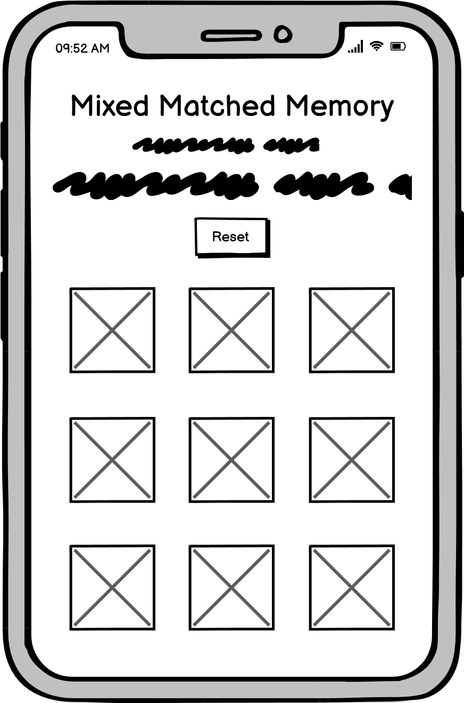
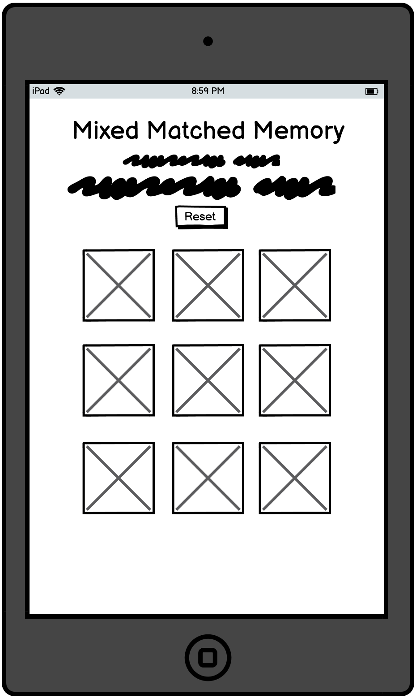
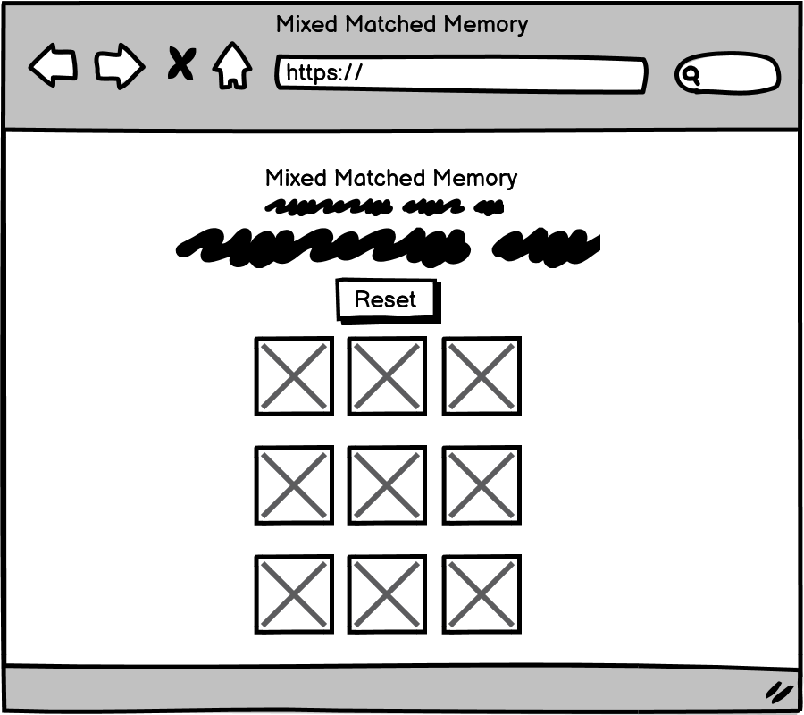
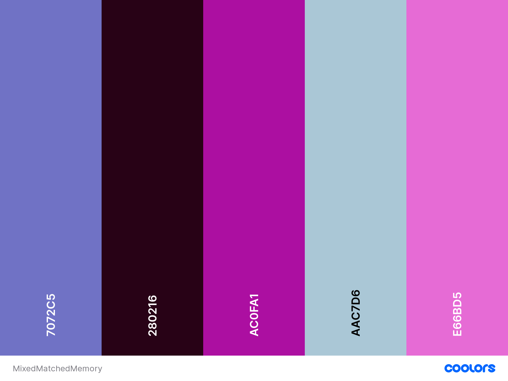
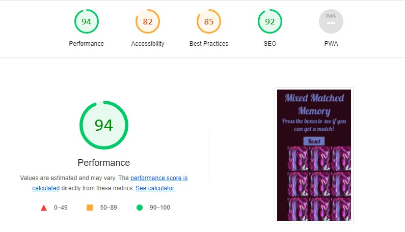

# Drinking memory-game #

[View the live site here](https://emmanoelles.github.io/Mixed_Matched_Memory/)

## Table of contents ##
* [Introduction & project goals](#introduction--project-goals)
* [UX](#ux)      
    * [User stories](#user-stories)      
    * [Design](#design)
    * [Features](#features)  
* [Technologies](#technologies)    
* [Testing](#testing)   
* [Deployment](#deployment)    
* [Credit](#credit)  
* [Acknowledgements](#acknowledgements)
---

### Introduction & Project Goals ###
 This project is a simple drinking game, for those who love a simple drinking game and do not carry a pack of cards on them for anytime they go drinking. This website will be easy for people to access so they can play a simple yet fun drinking.

 This project is part of my Full Stack Web Development Program at The Code Institute. It is the second one I have created and is the one that I have most enjoyed making so far.

 The main requirements for this project were to create a web program that includes HTML, CSS and Javascript.

## UX ##

### User Stories ###  
As a User, I want:
* Attractive colours that are easy to see.
* Easily legible writing.
* Simple rules.
* Easy way to reset the game.
* Distinct pictures.
* Time to read the winning message.
* Ability to play without a timer to allow a large group to play.
* Have fun while playing.
* Easily clickable cards.
* To not have to scroll to find the game.

### Development planes ###  

To make sure that I was achieving these goals, I worked with my family over Christmas to see how we felt about a game such as this.

### Strategy ###  

This game was made for adults who enjoy having a bit of fun whille they drink. 

### User Goals ###  
*  The user wants to have fun.
*  The user wants to have relax.
*  The user wants to have drinks quickly.

### Site Owner Goals ###  
* The site owner wants the user to have fun.
* The site owner wants the user to be able to easily use the website.
* The site owner wants the user to be able to be able to read everything on the website.

### Skeleton ###  
All Wireframes were made using Balsmiq.

#### Design for mobile device: ####  

  
#### Design for tablet device: ####

#### Design for desktop device: ####

### Design ### 
The Design of this game was originally going to be a fun kids game based on funny looking animals, however during the making of this game, my grandfather passed away and he did enjoy having a drink and drinking games. 

This game is one page, so theres no scrolling to find the game. Its uncomplicated as nobody wants to jump through hoops to paly a simple game.

* Fonts  
  
  [Google Fonts](https://fonts.google.com/specimen/Pushster): font-family: 'Pushster', cursive;.  
  I chose this font as I thought it sticks out yet remains elegant which looks nice with the deep purple.

* Colours  

I picked the colors by picking colors using the dropper feature on the image that i chose that covers the cards to pull everything together.
  
  * Background: #280216
  * Text: #7072c5     

  Color Scheme from [Coolors](https://coolors.co/)  
     

### Features ###  

This Memory Game should be working across all screensizes so it can be used on a phone, tablet or computer. 

Features that have been implemented:  
* Memory-game  
  Let`s the user play a memory game with twelve cards, and by flipping them try to find all matching pairs.  

* Reset button  
  Let`s the user reset the game to play again.  

* Easy to navigate on all screensizes  
  By making the layout look the same by adding responsivnes, it is easy for the user to navigate on all screensizes.  

* GitHub link  
  GitHub link takes the user to the developers GitHub page.  

Features that I want to implement in the future:  
* Increased difficulty
* Fully Styled Alert button
* Sound when boxes in Memory Game are pushed  

### Technologies ###  
Languages  
* [HTML](https://no.wikipedia.org/wiki/HTML)  
* [CSS](https://en.wikipedia.org/wiki/CSS)
* [JS](https://no.wikipedia.org/wiki/JavaScript)  

Tools / Libraries  
* [Git](https://git-scm.com/)  
Git was used for version control by utilizing the GitPod terminal to commit to Git and push to GitHub.     
* [Google Fonts](https://fonts.google.com/)  
Google fonts was used to import the fonts Peralta, Roboto and Sans-serif into the style.css file.  
* [Unsplash](https://unsplash.com/)  
Unsplash was used for all the images on the web application.
* [Coolors](https://coolors.co/)  
Coolors was used to make the colorpalett.  
* [Be Funky](https://www.befunky.com/)  
Be Funky was used to resize the images in the Memory Game to avoid stretch.

### Testing ###  
 * [The W3C Markup Validation Service](https://validator.w3.org/)  was used to validate my HTML and came back clear.
 * [The W3C CSS Validation Service](https://jigsaw.w3.org/css-validator/) was used to validate my css and came back fully clear.
 * [JS Hint](https://jshint.com/) was used to validate my javascript.
 *  

### Deployment ###  
  Deploying on GitHub pages  
  
  To deploy on GitHub pages from it`s GitHub respository, the following steps were taken:  
    
  1. Log into [GitHub](https://github.com/login "Link to GitHub login page") or [create an account](https://github.com/join "Link to GitHub create account page").  
  2. Locate the [GitHub Respository](https://github.com/Carhul/ms2-kids-memory-game "Link to GitHub repository").  
  3. At the top of the repository, select Settings from the menu items.  
  4. Scroll down the Settings page to the "GitHub Pages" section and push the blue "Check it out here!" text.  
  5. Under "Source" click the drop-down menu labelled "None" and select "Master".  
  6. Select "save", and the page will automatically refresh meaning that the website is now deployed.  
  7. Copy the deployed link to your live website!  

  ### Forking the Repository ###  

  By forking the GitHub Repository we make a copy of the original repository on our GitHub account to view and/or make changes without affecting the original repository by using the following steps:  
    
  1. Log into [GitHub](https://github.com/login "Link to GitHub login page") or [create an account](https://github.com/join "Link to GitHub create account page").  
  2. Locate the [GitHub Respository](https://github.com/Carhul/ms2-kids-memory-game "Link to GitHub repository").  
  3. At the top of the repository, on the right side of the page, select "Fork".  
  4. You should now have a copy of the original repository in your GitHub account.  

  ### Creating a Clone ###  

  How to run this project locally:  

   1. Install the [GitPod Browser](https://www.gitpod.io/docs/browser-extension/ "Link to Gitpod Browser extension download") Extension for Chrome.  
   2. After installation, restart the browser.  
   3. Log into [GitHub](https://github.com/login "Link to GitHub login page") or [create an account](https://github.com/join "Link to GitHub create account page").  
   4. Locate the [GitHub Respository](https://github.com/Carhul/ms2-kids-memory-game "Link to GitHub repository").  
   5. Click the green "GitPod" button in the top right corner of the repository.
  This will trigger a new gitPod workspace to be created from the code in github where you can work locally.  

  How to run this project within a local IDE, such as VSCode:  

  1. Log into [GitHub](https://github.com/login "Link to GitHub login page") or [create an account](https://github.com/join "Link to GitHub create account page").  
  2. Locate the [GitHub Respository](https://github.com/Carhul/ms2-kids-memory-game "Link to GitHub repository").  
  3. Under the repository name, click "Clone or download".  
  4. In the Clone with HTTPs section, copy the clone URL for the repository.  
  5. In your local IDE open the terminal.  
  6. Change the current working directory to the location where you want the cloned directory to be made.  
  7. Type 'git clone', and then paste the URL you copied in Step 3.  

    git clone https://github.com/USERNAME/REPOSITORY  
  
  8. Press Enter. Your local clone will be created.  

  Further reading and troubleshooting on cloning a repository from GitHub [here](https://docs.github.com/en/free-pro-team@latest/github/creating-cloning-and-archiving-repositories/cloning-a-repository "Link to GitHub troubleshooting").

### Credit ###  

Content in the game was made up by my friends, family and me as a small tribute to my grandfather who passed while I was making the game.
  
#### Images ####  

Background images:  

* All images are taken from Unsplash.com, and resized using Befunky.com.

Memory Game:  

* [Ania Kubow](https://www.youtube.com/watch?v=tjyDOHzKN0w) on youtube.  
* [Carhul](https://github.com/Carhul) / ms2-kids-memory-game on GitHub.

ReadMe File Layout:
* [Carhul](https://github.com/Carhul) / ms2-kids-memory-game on GitHub.
    
### Acknowledgements ###

* My cousin and his wife, for helping me fix some of my code.
* My friends, for providing inspiration for this project.
* My family, for their support through this.